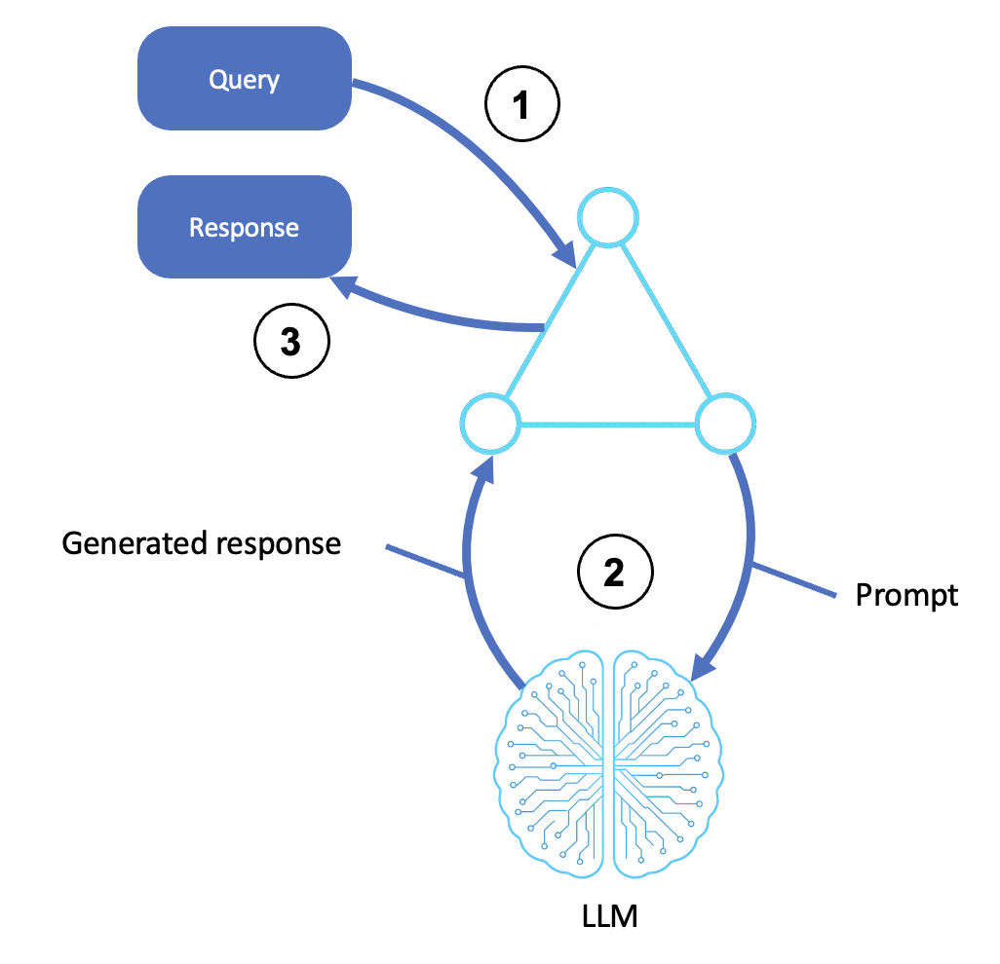
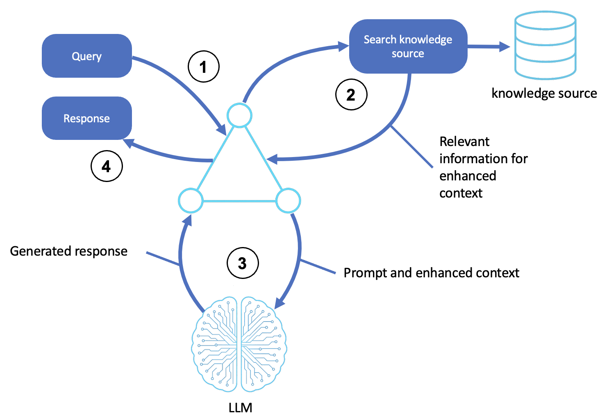

# Building Basic Reasoning Agents with Amazon Bedrock and Strands SDK

*A practical guide to creating your first AI agent using AWS services*

---

This is the first post in a series covering the [AWS Prescriptive Guidance for Agentic AI Patterns](https://docs.aws.amazon.com/prescriptive-guidance/latest/agentic-ai-patterns/). Each post focuses on the concepts, history, and patterns behind a single agent type, paired with a [hands-on sample on GitHub](README.md). We'll start with the simplest pattern, basic reasoning agents, and build from there.

## Introduction

AI agents have become a fixture in tech conversations, even as the path from concept to working implementation remains unclear for many teams. Developers hear about autonomous systems that can reason, retrieve information, and take actions. Building one from scratch can feel daunting, but they don't have to be. AI agents are simply software systems that leverage artificial intelligence to reason, plan, and complete tasks on behalf of humans or systems. Unlike traditional software that follows fixed rules, AI agents operate independently, adapting through multi-step processes to achieve specific goals.

AI agents combine foundation models for reasoning and planning with discrete agentic tools (like guardrails, knowledge bases, and business logic) to process requests, retrieve information, and execute tasks. They can search knowledge bases, call APIs, update systems, and make decisions based on user needs and environmental context.

By the end of this post, you'll understand:
- What makes an AI agent different from a simple API call
- How basic reasoning agents work under the hood
- How to build your first agent using the Strands SDK and Amazon Bedrock
- When to use basic reasoning agents in your applications

---

## The Road to Agents: A Brief History

To understand why agents matter now, it helps to understand where the need for agents came from.

### The AI Evolution

Artificial intelligence has evolved through distinct phases, each solving limitations of the previous:

**Traditional ML (2010s)**: Early machine learning models excelled at narrow tasks: image classification, fraud detection, recommendation engines. They required massive labeled datasets and could only do what they were explicitly trained for. A model trained to identify cats couldn't suddenly identify dogs.

**Deep Learning Breakthroughs (2015-2020)**: Neural networks grew deeper and more capable. In March 2016, [DeepMind's AlphaGo defeated world champion Lee Sedol](https://en.wikipedia.org/wiki/AlphaGo_versus_Lee_Sedol) 4-1 in a landmark match that demonstrated AI could master complex strategy games. But these systems were still specialists, useless at everything except what they were specifically trained for. You couldn't reliably ask AlphaGo to write an email. Additionally, scientists later learned that these specialized models like AlphaGo could be beaten and tricked using simple strategies that exploited weaknesses that any human player would have no trouble adapting to. It was clear that flexibility was not AI's strong suit.

**Large Language Models (2020-2023)**: The [transformer architecture](https://arxiv.org/abs/1706.03762), introduced in the 2017 paper "Attention Is All You Need" by Vaswani et al., changed everything. Models trained on vast text corpora could suddenly generalize across tasks. When [OpenAI released GPT-3 in June 2020](https://en.wikipedia.org/wiki/GPT-3) with 175 billion parameters, it demonstrated that LLMs could write code, answer questions, translate languages, and reason about problems. For the first time, we had AI that could handle the breadth of human knowledge work.

### The LLM Limitation

But LLMs had a fundamental constraint: they could only work with what they knew at training time.

Ask an LLM about yesterday's stock prices? It doesn't know as it was trained on data from 6 months ago. Ask it to calculate compound interest precisely? It might hallucinate and get it wrong. Ask it to send an email or update a database? It can't, it can only generate text in response to a prompt.

This created a gap between what LLMs could theoretically do and what businesses actually needed.

### RAG: The First Bridge

[Retrieval-Augmented Generation (RAG)](https://arxiv.org/abs/2005.11401), introduced by Lewis et al. at Facebook AI Research in 2020, was the first major solution. Instead of relying solely on training data, RAG systems retrieve relevant documents before generating responses. This let businesses ground LLM responses in their own data—product catalogs, policy documents, knowledge bases.

RAG reduced hallucinations and made LLMs useful for domain-specific applications. But it still couldn't solve the action problem. An LLM with RAG could tell you the answer, but it couldn't do anything about it.

### Enter Agents

Agents bridge the action gap. The [ReAct framework](https://arxiv.org/abs/2210.03629), introduced by Yao et al. in 2022, showed that LLMs could interleave reasoning with actions. Shortly after, Meta's [Toolformer](https://arxiv.org/abs/2302.04761) demonstrated that LLMs could teach themselves when and how to call external tools. Together, these papers established the foundation for modern AI agents.

An agent is an autonomous system powered by an LLM that goes beyond answering questions. Instead of just answering "What's the weather in Seattle?", an agent can check a weather API and tell you. Instead of explaining how to book a flight, an agent can actually book it.

### Why Now?

Several factors converged to make agents practical:

- **Model capability**: LLMs became good enough at reasoning to reliably select and use tools
- **Cost reduction**: Inference costs dropped, making multi-step agent workflows economically viable
- **Standardization**: Protocols like the [Model Context Protocol (MCP)](https://www.anthropic.com/news/model-context-protocol), introduced by Anthropic in November 2024, standardized how agents communicate with tools
- **Infrastructure**: Platforms like [Amazon Bedrock](https://aws.amazon.com/bedrock/) and [Amazon Bedrock AgentCore](https://docs.aws.amazon.com/bedrock-agentcore/latest/devguide/) made deployment and scaling manageable

### The Core Capabilities

A [comprehensive survey of LLM-based autonomous agents](https://arxiv.org/abs/2308.11432) by Wang et al. proposed a unified framework built around four modules: profiling, memory, planning, and action. The [AWS Prescriptive Guidance for Agentic AI](https://docs.aws.amazon.com/prescriptive-guidance/latest/agentic-ai-patterns/agent-patterns.html) expands on this with eleven agent patterns or use cases. We can group these into five core capabilities:

| Capability | Description | Example |
|------------|-------------|---------|
| **Reasoning** | Basic LLM inference and decision-making | Answering questions, classification |
| **Tool Use** | Invoking external functions and APIs | Checking weather, querying databases |
| **Planning** | Breaking complex tasks into steps | Multi-step research, workflow automation |
| **Memory** | Retaining context across interactions | Personalized assistants, session continuity |
| **Orchestration** | Coordinating multiple agents | Specialized teams, parallel processing |

This series covers various examples of all five, and we'll start with the simplest: reasoning.

---

## What Is a Basic Reasoning Agent?

A basic reasoning agent is the simplest form of agentic AI. It takes a query, processes it through a large language model (LLM), and returns a response.

Think of it as the foundation. Before you can build agents that browse the web, execute code, or coordinate with other agents, you need to understand this core pattern.

### The Three-Step Process

Every basic reasoning agent follows the same workflow:

1. **Receives input**: A user or system submits a query or instruction
2. **Invokes the LLM**: The agent transforms the query into a structured prompt and sends it to the model
3. **Returns response**: The generated output is formatted and returned to the user

That's it. Simple, but powerful.

---

## Reasoning Plus Retrieval: The RAG Pattern

A basic reasoning agent only knows what the model learned during training. When you need answers grounded in your own data, ie. product catalogs, policy documents, internal wikis, you include [Retrieval-Augmented Generation](https://aws.amazon.com/what-is/retrieval-augmented-generation/) (RAG).

### How RAG Works

RAG extends a reasoning agent with three steps:

1. **Retrieve**: Find relevant information from a knowledge base
2. **Augment**: Inject that information into the prompt as context
3. **Generate**: Produce a response grounded in the retrieved context

The payoff is fewer hallucinations and answers tied to your domain, all without retraining the model.

### Keyword Search vs. Vector Search

The simplest form of retrieval is keyword matching: look for query terms in your documents. It's easy to reason about, but it breaks down on meaning. Ask "How do I fix my car?" against docs that say "automobile repair instructions," and keyword search finds nothing.

*Vector search*, also called semantic search, solves this. Text is converted into numerical vectors called embeddings that capture meaning. Conceptually similar items sit close together in vector space, so a query finds its nearest neighbors regardless of exact wording. This is why production RAG systems pair an embedding model with a vector store such as [Amazon OpenSearch Service](https://docs.opensearch.org/latest/vector-search/ai-search/semantic-search/) or a managed option like [Amazon Bedrock Knowledge Bases](https://docs.aws.amazon.com/bedrock/latest/userguide/knowledge-base.html), which handles chunking, embedding, and retrieval for you.

The companion sample implements both ideas: a keyword-based knowledge base that makes the pattern obvious, with notes on where vector search fits in production.

---

## When to Use Basic Reasoning Agents

Basic reasoning agents excel at understanding, generating, or transforming text. They work best when the answer can come from the model's training data (or context you've passed in).

| Use Case | Example |
|----------|---------|
| **Conversational Q&A** | Answering questions using LLM knowledge |
| **Policy explanations** | Summarizing and explaining documents |
| **Classification** | Labeling, scoring, or categorizing content |
| **Text transformation** | Formatting, translating, or restructuring text |
| **Knowledge base Q&A** | Answering questions with retrieved context (RAG) |
| **Customer support** | Responding using product documentation |

---

## What's Next

You now understand what a basic reasoning agent is, where the pattern came from, and when to reach for it. The natural next step is to see it run. The **[companion sample](README.md)** takes you from an empty file to a working Strands agent in a few minutes.

But what if you need an agent to check the weather, query a database, or perform calculations? That's where tool-based agents come in. In the [next post](https://github.com/aws-samples/sample-tool-based-agents-functions/blob/main/Extending%20AI%20Agents%20with%20Custom%20Tools%20and%20Functions.md), we'll extend our agent with custom functions that let it interact with the outside world.

---

## Resources

- [Companion sample: Basic Reasoning Agents](README.md)
- [AWS Prescriptive Guidance - Basic Reasoning Agents](https://docs.aws.amazon.com/prescriptive-guidance/latest/agentic-ai-patterns/basic-reasoning-agents.html)
- [Strands Agents Documentation](https://strandsagents.com/)
- [Amazon Bedrock User Guide](https://docs.aws.amazon.com/bedrock/latest/userguide/what-is-bedrock.html)

---

**Tim Sitze** is a Solutions Architect at Amazon Web Services, where he works with cybersecurity ISVs to design and scale their products on AWS. He specializes in security, AI/ML, IoT and data platform architectures, and has partnered on workloads spanning identity threat intelligence, agentic AI, and cloud-native security operations. Tim is based in the Washington, D.C. area.  
